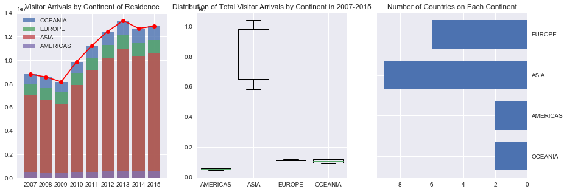
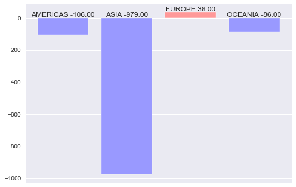
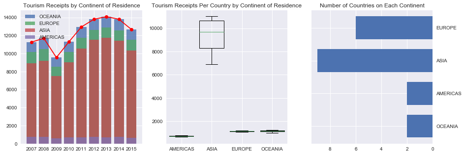
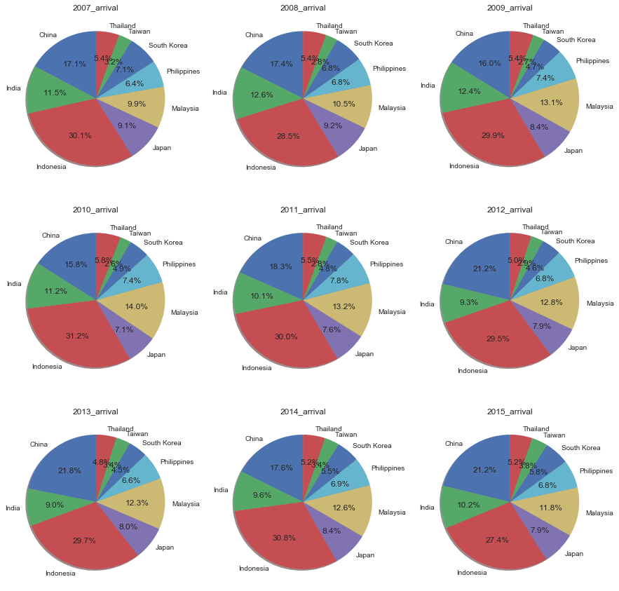
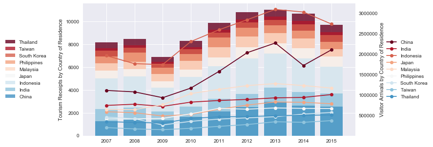
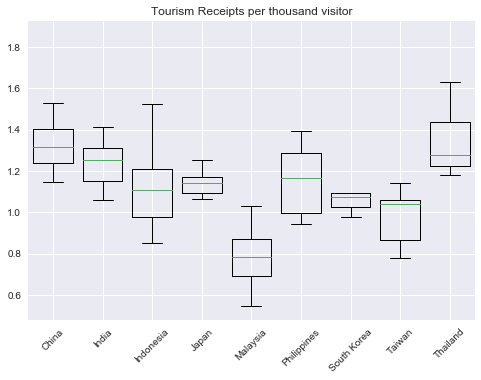
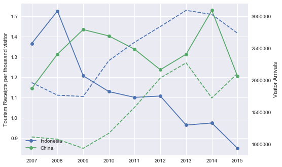

# Tourism-statistics-of-Singapore

The data were collected from STB (Singapore Tourism Board) website. The annual report on tourism statistics in 2015 contains visitor arrivals to Singapore from 2006 to 2015 and tourism receipts from 2011 to 2015. The missing data of tourism receipts during 2007 to 2010 were collected from the 2011 annual report. Thus the final dataset contains visitor arrivals and tourism receipts from 19 countries in the period of 2007-2015, serving as a reference to analyze the performance of the Singapore tourism industry. 

The plot shows a tremendous decrease in both visitor arrivals and tourism receipts in 2009 due to the ever worst financial crisis of 2007-2008, followed by a gradually recover of the tourism industry until 2013. Since then, not only the number of visitors but also travel expenses is shrinking. Among the 9 Asian countries, Indonesia and China top the list of both arrivals and receipts accounting for almost 50% of the market. Interestingly, during the downturn from 2014 to 2015, Chinese visitors increased almost 22% (383784) while its tourism receipts slightly decreased. The decline in Indonesian visitors (drop by 10%) along with the reduction in personal consumption (13%) are considered as the direct reason for the decrease in tourism receipts. The same decrease (22%) has also been found in Chinese tourists from 2014 to 2015. 

Additional analysis and figures can be found in the source code

